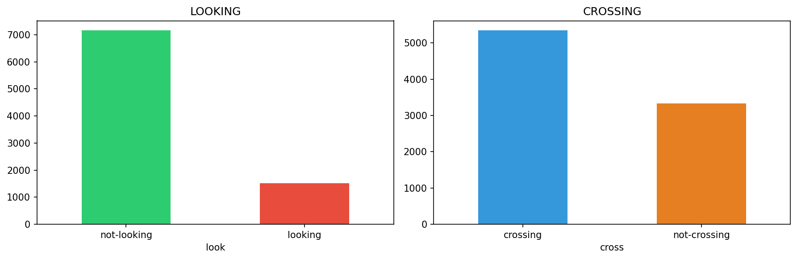
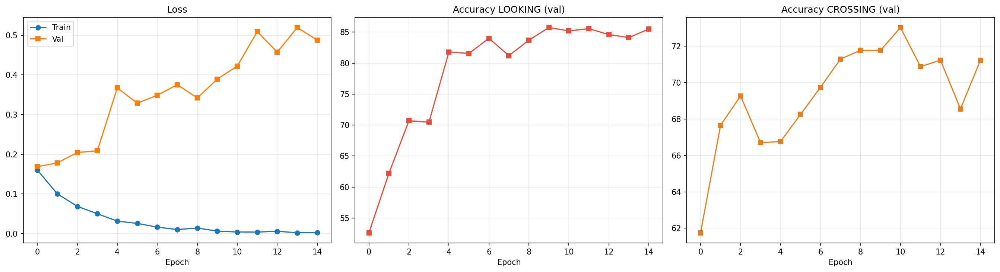
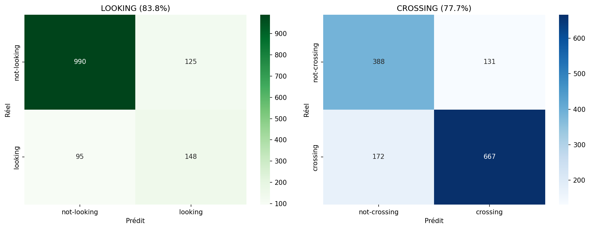

# Détection multi-tâches du comportement des piétons (JAAD)

Modèle de vision par ordinateur qui prédit **simultanément** deux comportements à risque d'un piéton à partir d'une simple image découpée (*crop*) :

- **LOOKING** — le piéton regarde-t-il vers le véhicule ? (`looking` / `not-looking`)
- **CROSSING** — le piéton est-il en train de traverser ? (`crossing` / `not-crossing`)

Le modèle repose sur un **ResNet-18** pré-entraîné, partagé par deux têtes de classification (architecture *multi-task*), entraîné sur le dataset **JAAD** (*Joint Attention in Autonomous Driving*).

---

## Pourquoi ce projet

La combinaison **« ne regarde pas + traverse »** est la situation la plus dangereuse en conduite urbaine. Détecter ces deux signaux en même temps, plutôt qu'un seul, est l'idée centrale du projet : un seul réseau, deux prédictions, partage des caractéristiques apprises.

---

## Pipeline

```
Vidéos JAAD + annotations XML
        │
        ▼
Extraction des crops piétons (1 frame /10, filtres taille & occlusion)
        │
        ▼
Split par VIDÉO (pas de fuite de données entre train/val/test)
        │
        ▼
ResNet-18 partagé  ──►  tête LOOKING  (2 classes)
                   └─►  tête CROSSING (2 classes)
        │
        ▼
Évaluation + démo vidéo annotée
```

---

## Données

Dataset **JAAD** : 346 vidéos de conduite urbaine annotées image par image.

Après extraction (1 frame sur 10, piétons d'au moins 50 px, occlusion partielle tolérée, occlusion totale exclue) :

| | Quantité |
|---|---|
| Crops extraits | **8 676** |
| Vidéos sources | 314 |
| Train / Val / Test | 5 642 / 1 676 / 1 358 |

Le découpage est réalisé **par vidéo** (`GroupShuffleSplit`) : aucune image d'une même vidéo ne se retrouve à la fois en entraînement et en test, ce qui évite toute fuite de données et donne une évaluation honnête.

Les deux tâches sont **déséquilibrées** (surtout LOOKING, ~18 % de `looking`), ce qui motive le choix de la fonction de perte ci-dessous.



---

## Méthode

- **Backbone** : ResNet-18 pré-entraîné (ImageNet), caractéristiques partagées par les deux têtes.
- **Têtes** : deux blocs identiques `Linear(512→128) → ReLU → Dropout(0.3) → Linear(128→2)`.
- **Perte** : **Focal Loss** (γ = 2) avec pondération de classes `balanced` — insiste sur les exemples difficiles et compense le déséquilibre sans sur-échantillonnage redondant.
- **Perte combinée** : `α · loss_looking + (1−α) · loss_crossing`, avec α = 0.5.
- **Optimiseur** : Adam (lr = 1e-4, weight decay = 1e-4) + scheduler *cosine annealing*.
- **Augmentation** : flip horizontal, color jitter, redimensionnement 224×224, normalisation ImageNet.
- **Early stopping** sur le F1-score de la classe `looking` (la plus rare et la plus critique).

Modèle : ~11,3 M de paramètres.

---

## Résultats (sur le test, sans fuite de données)

| Tâche | Accuracy | F1 (classe rare) |
|---|---|---|
| **LOOKING** | **83,8 %** | 0,57 (`looking`) |
| **CROSSING** | **77,7 %** | 0,81 (`crossing`) |

Rapport de classification détaillé :

| LOOKING | précision | rappel | F1 | support |
|---|---|---|---|---|
| not-looking | 0,91 | 0,89 | 0,90 | 1115 |
| looking | 0,54 | 0,61 | 0,57 | 243 |

| CROSSING | précision | rappel | F1 | support |
|---|---|---|---|---|
| not-crossing | 0,69 | 0,75 | 0,72 | 519 |
| crossing | 0,84 | 0,79 | 0,81 | 839 |

### Courbes d'entraînement



### Matrices de confusion



> **Lecture honnête des résultats.** La classe minoritaire `looking` reste la plus difficile (F1 ≈ 0,57) : le modèle la détecte correctement dans ~61 % des cas, ce qui est attendu vu sa rareté dans JAAD. Travailler à partir d'un seul crop, sans contexte temporel, est aussi une limite assumée (voir Pistes d'amélioration).

---

## Démo

Le notebook génère une vidéo annotée où chaque piéton est encadré avec ses deux prédictions et leur niveau de confiance. Le cadre passe en **rouge** lorsque la situation dangereuse est détectée (`not-looking` + `crossing`), sinon en **vert**.

---

## Utilisation

Le projet est conçu pour **Google Colab** (GPU recommandé, A100/T4).

1. Placer le dossier `JAAD/` (vidéos + annotations) dans le Drive, ou laisser le notebook cloner le dépôt et télécharger les clips automatiquement.
2. Ouvrir `Détection_du_comportement_des_piétons.ipynb`.
3. Exécuter les cellules dans l'ordre : extraction des crops → split → entraînement → évaluation → démo.

Dépendances principales :

```
torch · torchvision · ultralytics · opencv-python · scikit-learn · pandas · numpy · matplotlib · seaborn · Pillow · tqdm
```

---

## Structure du dépôt

```
.
├── Détection_du_comportement_des_piétons.ipynb   # notebook complet
├── figures/
│   ├── dataset_distribution.png
│   ├── training_curves.png
│   └── confusion_matrices.png
└── README.md
```

---

## Pistes d'amélioration

- Ajouter une **dimension temporelle** (séquence de frames / LSTM ou Transformer) plutôt qu'un crop isolé.
- Exploiter le **contexte de la scène** (position dans l'image, vitesse apparente).
- Tester des backbones plus récents et un *fine-tuning* progressif du ResNet.

---

## Crédits

- **Dataset** : [JAAD — Joint Attention in Autonomous Driving](https://github.com/ykotseruba/JAAD)
- **Projet académique** — Master 2 Vision et Machines Intelligentes, Université Paris Cité.

